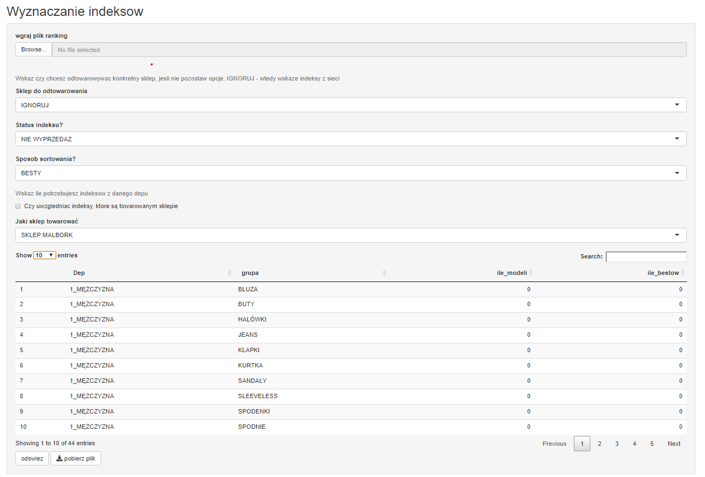
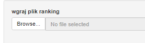
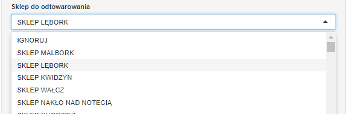
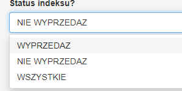
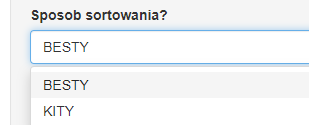
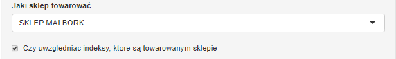
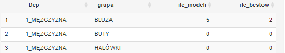
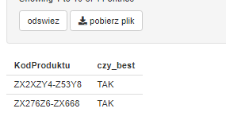
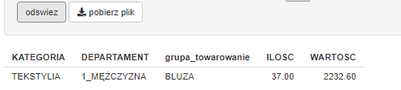

# aplikacja_do_wyznaczania_indeksow

### Korzystając z aplikacji możemy wytypować indeksy bestsellerów i kitów, które chcemy dołożyć lub zabrać z konkretnego sklepu w ramach grup produktowych.

&nbsp;

Narzedzie zostalo przygotowane w jezyku R, przy pomocy R Shiny.
Dane surowe zostały wygenerowane sztucznie.

Aplikacja w wersji demonstracyjnej jest dostepna pod poniższym [adresem](https://tararuj4.shinyapps.io/aplikacja_do_wyznaczania_indeksow/)

## Źródło danych

Plik jest zasilany następującymi danymi zewnętrznymi:
- ranking indeksow (wgrywany bezpośrednio przez użytkownika) generowany przez "skrypt do wyznaczania indeksów"
- stany_biezace_sklepy - aktualne zatowarowanie sklepów (w wersji demonstracyjnej dane zaszyte w skrypcie, oryginalnie dostarczane w formie danych surowych),
- stan_sklep - skrócona wersja pliku stany_biezace_sklepu, przetworzona w skrypcie "skrypt do wyznaczania indeksów" (w wersji demonstracynej dane zaszyte w skrypcie).

## Schemat działania
---

Aplikacja po wgraniu danych surowych ("ranking indeksów" w przypadku wersji demonstracyjnej), wybraniu dostępnych ustawień oraz po wytypowaniu ilości w ramach zdefiniowanych grup, generuje nam listę indeksów, które należy zwrócić z danego sklepu lub dotowarować nimi dany salon.

## Korzyści
---

Wykorzystując skrypt udało się zaoszczędzić: 
- 2 roboczogodziny raz na 2 tygodnie, w sytuacji gdy towarujemy nowy sklep i poszukujemy określonej ilosci indeksów pod jego zatowarownie.
- średnio po 40 minut na 1 sklep podczas bieżacej pracy alokatora, który potrzebuje wskazać indeksy, które powinien dotowarować lub zabrać z danego sklepu

Dodatkowo wybór indeksów do wskazanych ruchów towarowych nie jest przypadkowy tylko uzasadniony danymi statystycznymi. 
Oprócz tego udało się również wykluczyć błąd ludzki polegający na wytypowaniu niewłaściwych indeksów, o najnizszym potencjale lub nieświadomym dublowaniu tych samych pozycji. 

## Szczegółowy opis funkcjonalności
---

- Na wstępie wgrywamy plik ze wskazanego miejsca na serwerze

&nbsp;

- Następnie możemy wskazać, który sklep chcemy odtowarować.
Możemy wybrać konkretny salon lub wybierać indeksy z całej sieci.

&nbsp;

- Następnie wskazujemy czy jesteśmy zainteresowani indeskami z oferty wyprzedażowej, niewyprzedażowej czy nie ma to dla nas znaczenia.

&nbsp;

- Kolejny krok to wybór indeksów, wskazujemy czy chcemy patrzeć i typować bestsellery czy indeksy sprzedające się najsłabiej, tzw. kity.

&nbsp;

- W kolejnym kroku wskazujemy jaki sklep chcemy dotowarować oraz poniżej czy chcemy typować indeksy, które już znajdują się na tym sklepie. 

&nbsp;

- Głównym elementem pracy na poniżej aplikacji jest wskazanie ile modeli ma wygenerować skrypt z poszczególnej grupy towarowej. Dokonujemy tego poprzez wpisanie ilości w kolumnie ile_modeli

Dodatkowo gdy towarujemy sklep lub chcemy wzmocnić zatowarowanie najlepszym indeksami, możemy poprzez wpisanie ilości w kolumnie ile_bestów przekazać do generowanych na końcu danych surowych informacje, które indeksy mają być potraktowane specjalnie.

&nbsp;

- Aby skrypt mógł się uruchomić należy po wgraniu wszystkich potrzebnych danych i ustawień kliknąć opcję "odśwież".

Wtedy skrypt wyświetli listę indeksów wraz z dopiskiem czy dany indeks ma mieć dopisek 'tak' w kolumnie czy_best (przy wybraniu opcji INGORUJ w polu Sklepy do odtowarowania) lub wartość i ilość towaru do ściągnięcia ze sklepu z danej grupy towarej (przy wybraniu jakiegoś konkretnego sklepu).

&nbsp;

- Gdy rezultat pracy algorytmu jest satysfakcjonujący, u dołu alplikacji klikamy w opcję "pobierz plik".

W zależności od tego czy wskazaliśmy sklep do odtowarowania otrzymamy inne dane w pliku, który pobieramy z aplikacji.  

**Rezultatem powyższych działań jest plik csv, w poniższym układzie - dla opcji IGNORUJ:**

| KodProduktu |czy_best | 
|----|---|
|    |   |
|    |   | 
|    |   |

**Jeżeli wskazaliśmy konkretny sklep to dane wygenerują się w poniższym formacie:**

| KodProduktu |Rozmiar | Magazyn| Ilosc | 
|----|---|---------|---------|
|    |   |         |         |
|    |   |         |         |
|    |   |         |         |

----
Wygenerowane dane wykorzystywane są w innych skryptach:
- skrypt do towarowania nowych sklepów,
- aplikacja_algorytm autumatyczne MMki.
